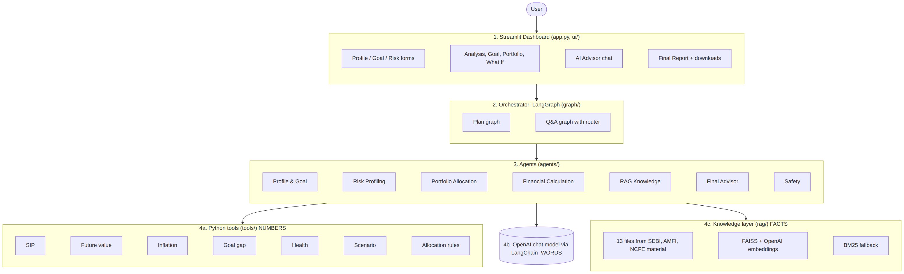

# AI Personal Financial Advisor

**A Multi-Agent AI System for Goal-Based Personal Financial Planning** (academic prototype)

The app takes a user's finances, one financial goal and a 7 question risk questionnaire. Specialised agents, orchestrated with LangGraph, then work out whether the goal is on track, the monthly SIP needed, an illustrative equity / debt / gold allocation, and a plain language plan grounded in SEBI, AMFI and NCFE investor education material. A Safety Agent checks every piece of AI written text before the user sees it.

> **Disclaimer.** This is an educational academic prototype. It is not guaranteed and it is not regulated financial advice. All returns and inflation rates are illustrative assumptions, not forecasts. Consult a SEBI registered investment adviser before investing.



---

## 1. Problem statement

People often struggle to convert financial goals into measurable investment plans, and to understand how risk, time horizon, inflation and the required monthly investment relate to each other. Generic chatbots make this worse: they can state wrong numbers confidently, promise returns, or invent products and sources.

## 2. Objectives

1. Personalise financial education around the user's own numbers and goal.
2. Automate basic financial calculations (SIP, inflation, goal gap, financial health) with deterministic code.
3. Improve goal based planning with a clear target, gap and action plan.
4. Explain risk and assumptions in simple language.
5. Reduce hallucination through RAG, structured outputs and a safety layer.
6. Improve transparency through explainable, source cited recommendations.

## 3. Features

| Area | What it does |
|---|---|
| Profile and goal | Validated inputs (no negative values), cash flow warnings, goal in today's or future value, free text goal read by the AI and cross checked against the form |
| Risk profiling | 7 questions, score 7 to 21, transparent bands; 3 answers suggested from the user's own numbers |
| Calculations | SIP, future value, inflation, goal gap, financial health, scenarios, yearly projection; all Python, all unit tested |
| Allocation | Illustrative equity / debt / gold tables, time horizon guardrail, emergency reserve gap |
| RAG | 13 knowledge files written from SEBI, AMFI (Mutual Funds Sahi Hai) and NCFE material, FAISS semantic search with a BM25 keyword fallback |
| AI Advisor chat | Router sends each question to a tool calling agent, the RAG agent, or a polite out of scope reply |
| Safety | Rule checks plus an optional LLM judge; unsafe plan text is rewritten (max 2 times) or withheld; unsafe answers are withheld |
| What If | Change return, inflation, SIP and horizon; see the effect instantly, labelled as hypothetical |
| Report | 10 section plan, downloadable as Markdown or HTML (print to PDF), plus a privacy safe session log |
| Evaluation | One command produces the metrics table from 54 labelled cases and 24 synthetic users |

## 4. Architecture

Full diagrams: [`docs/architecture.md`](docs/architecture.md) (Mermaid source) and [`docs/diagrams/`](docs/diagrams/) (PNG and SVG).

**Core rule: numbers come from Python tools, words come from the LLM, facts come from the knowledge base or the user.**

| Layer | Folder | Uses the LLM? |
|---|---|---|
| Streamlit dashboard | `app.py`, `ui/` | No |
| Orchestrator (LangGraph) | `graph/` | No (the router node calls the LLM) |
| Agents | `agents/` | Yes, only to understand, explain, route and check |
| Deterministic tools | `tools/` | Never |
| Knowledge base and retrieval | `rag/` | Embeddings only |

### Plan graph


`validate → profile → risk → portfolio → calculation → knowledge → advisor → safety → (revise → advisor, at most twice) → finalize`

The Portfolio Agent runs before the Calculation Agent because the goal calculation uses the allocation's weighted assumed return.

### Q&A graph


## 5. Agents

| Agent | File | Deterministic part | LLM part | Fallback without LLM |
|---|---|---|---|---|
| Profile & Goal | `agents/profile_agent.py` | Surplus, free surplus, warnings, missing info | Extracts goal type, amount (lakh/crore to rupees), horizon and priority from free text; mismatches with the form are reported | Form values only, priority not assessed |
| Risk Profiling | `agents/risk_agent.py` | Score 7 to 21 and category | Explains the score and lists key risk factors; cannot change the score | Risk factors listed from answers that scored 1 point |
| Portfolio Allocation | `agents/portfolio_agent.py` | Allocation table, guardrail, weighted return, emergency reserve gap | Explains why, how risk and horizon affect it, remaining risks | Percentages and guardrail reason still shown |
| Financial Calculation | `agents/calculation_agent.py` | Plan mode: fixed sequence of tool calls, each recorded | Q&A mode: LLM chooses the tool and fills arguments (tool calling) | Plan mode needs no LLM |
| RAG Knowledge | `agents/rag_agent.py` | Retrieval; removes any cited source that was not retrieved | Answers only from the retrieved context | "Not found in the knowledge base" |
| Final Advisor | `agents/advisor_agent.py` | Fills the numeric sections; escalation rules for professional advice | Summary, allocation explanation, action plan, risk explanations | All numbers delivered, narrative marked unavailable |
| Safety | `agents/safety_agent.py` | Rule checks A to F (below) | Optional judge for unsupported claims | Rules still run |
| Router | `graph/qa_graph.py` | | Classifies a question as calculation, knowledge or out of scope | Clear "needs an API key" message |

All prompts live in `prompts/agent_prompts.py`. Every LLM output is parsed into a Pydantic model (`schemas/agent_outputs.py`) through function calling, so malformed output fails validation instead of reaching the user.

## 6. Tools

| Tool | File | Formula / rule |
|---|---|---|
| SIP calculator | `tools/sip_calculator.py` | FV = P × [((1+r)^n − 1) / r] × (1+r), r = annual % / 12, n = months; r = 0 handled as FV = P × n |
| Future value | `tools/future_value.py` | Lump sum × (1+r)^n plus SIP future value (monthly compounding) |
| Inflation | `tools/inflation.py` | Future cost = present cost × (1 + inflation)^years |
| Goal gap and full plan | `tools/goal_gap.py` | Net target = inflated target − grown goal savings; gap = required SIP − current SIP |
| Financial health | `tools/financial_health.py` | Savings rate, expense ratio, debt to income, emergency months (prototype thresholds) |
| Scenario | `tools/scenario.py` | Re-runs the plan with changed return / inflation / SIP / horizon |
| Allocation rules | `tools/allocation.py` | Conservative 30/60/10, Moderate 60/30/10, Aggressive 75/15/10; horizon < 3 years → Conservative; 3 to 5 years → at most Moderate; Emergency Fund goal → 100% debt |
| Projection | `tools/projection.py` | Year by year balance for charts |
| LangChain wrappers | `tools/lc_tools.py` | 6 tools exposed to the Q&A agent; errors returned as `{"error": ...}` |

**Illustrative assumptions** (`config.py`, editable in the app): equity 12%, debt 7%, gold 8%, inflation 6%. These are round numbers for demonstration, not historical figures or forecasts.

## 7. RAG architecture


* **Knowledge base:** `rag/knowledge_base/` has 13 markdown files (SIP, compounding, inflation, asset allocation, diversification, equity risk, debt basics, gold, emergency fund, risk and return, mutual fund basics, risk disclosures, financial planning basics). Each file lists its sources and the date checked. Every paragraph is labelled as coming from a source, a general note, or an app note (the app's own assumptions).
* **Sources used:** SEBI Financial Education Booklet (Nov 2020), SEBI FAQs for Mutual Fund Investors (Aug 2024), SEBI Investor Education Programme page on mutual funds, NCFE Financial Literacy Booklet (2021), and Mutual Funds Sahi Hai pages on SIP, diversification and gold ETFs.
* **Chunking:** one chunk per section, max 900 characters, split on paragraphs with one paragraph of overlap; 70 chunks.
* **Retrieval:** embeddings from any OpenAI-compatible API (Google `gemini-embedding-001` in our runs, see `FREE_GEMINI_SETTINGS.txt`) + FAISS inner product on normalised vectors (cosine), top 4, minimum score 0.30. Without an index or key, BM25 keyword search runs on the same chunks and the UI says so.
* **Grounding:** the prompt allows answers only from the context; cited sources are checked against what was actually retrieved.

## 8. Installation

Requires Python 3.11 or newer (tested on 3.11 and on 3.14 for Windows).

```bash
git clone https://github.com/<your-username>/ai-financial-advisor.git
cd ai-financial-advisor
python -m venv venv
venv\Scripts\activate          # Windows
# source venv/bin/activate     # macOS / Linux
pip install -r requirements.txt
```

## 9. Environment setup

Copy `.env.example` to `.env` and fill in one of these. `.env` is in `.gitignore`, so your key is never uploaded to GitHub.

**Option A: OpenAI**

```
OPENAI_API_KEY=sk-...
MODEL_NAME=gpt-4o-mini
EMBEDDING_MODEL=text-embedding-3-small
```

**Option B: Google Gemini free tier** (used for the reported evaluation; key from https://aistudio.google.com/apikey)

```
OPENAI_API_KEY=<your Gemini key>
LLM_BASE_URL=https://generativelanguage.googleapis.com/v1beta/openai/
MODEL_NAME=gemini-3.5-flash-lite
EMBEDDING_MODEL=gemini-embedding-001
LLM_MAX_RETRIES=6
LLM_REQUEST_DELAY_SECONDS=4
```

The variable is still called `OPENAI_API_KEY` because Gemini is called through its OpenAI-compatible endpoint. Check the model names are still offered before running. Blank values fall back to the defaults. `JUDGE_MODEL_NAME` optionally sets a different model for the evaluation judge.

**Windows shortcut:** double click `RUN_EVERYTHING.bat` (creates the environment, runs tests, builds the index, smoke test and evaluation) and then `START_APP.bat`.

## 10. Running

| Command | What it does |
|---|---|
| `python -m rag.ingest` | Builds the FAISS index (needs the key; re-run after editing knowledge files) |
| `streamlit run app.py` | Starts the dashboard at http://localhost:8501 |
| `http://localhost:8501/?demo=U02` | Demo mode: loads a synthetic user and generates the plan |
| `pytest -q` | Runs the 338 automated tests (no key needed) |
| `python -m scripts.smoke_test_llm` | Quick live check of the LLM parts |
| `python -m evaluation.evaluate` | Full evaluation (add `--offline` to run without a key) |
| `python -m rag.query "question"` | Shows what retrieval returns |
| `python -m scripts.export_graphs` | Exports the LangGraph graphs as Mermaid |
| `python -m scripts.build_datasets` | Rebuilds the synthetic users and test cases |

The app works without an API key: every number, chart, allocation and the report are produced; AI explanations and chat are switched off with a clear message.

## 11. Example workflow

1. **Home:** click *Start Financial Assessment* (or load a sample user).
2. **User Profile:** age 29, income ₹85,000, living expenses ₹38,000, EMI ₹15,000, SIP ₹15,000, emergency fund ₹2,50,000.
3. **Financial Goal:** House, ₹25,00,000 in today's value, 6 years, ₹4,00,000 already saved.
4. **Risk Assessment:** answers score 16 → Moderate. Click *Save and generate my plan*.
5. **Financial Analysis:** surplus ₹32,000, savings rate 37.6%, debt to income 17.6%, emergency cover 4.7 months (Partial).
6. **Goal Analysis:** inflation adjusted target ₹35,46,298; required SIP ₹28,360 against ₹15,000, a gap of ₹13,360 that the ₹17,000 free surplus can cover.
7. **Portfolio:** Moderate 60/30/10, weighted assumed return 10.1%; build the emergency reserve first (about ₹68,000 more).
8. **What If:** lower the return to 8% and see the required SIP rise.
9. **AI Advisor:** ask "What happens if inflation increases to 8%?"; the router picks the calculation agent, which calls the scenario tool.
10. **Final Report:** download the plan as Markdown or HTML.

These figures come from sample user U02 and the app's default assumptions. Screenshots of every page are in `docs/screenshots/`.

## 12. Evaluation methodology

`python -m evaluation.evaluate` writes `summary.md`, `metrics.json`, `details.csv` and `manual_review.csv` to `evaluation/results/run_<timestamp>/`.

| Metric | Cases | Method |
|---|---|---|
| Calculation accuracy | 10 | Tools vs ground truth from an independent month by month simulation, ±₹1 |
| Risk classification | 6 + 24 | Questionnaire score vs label (deterministic by design) |
| Risk explanation consistency | 5 users × 3 | Category never changes; every explanation names it |
| Goal classification | 7 + 24 | LLM parsed goal type vs label; all stated fields for the 7 |
| Tool selection | 8 | Expected tool called (and called first) |
| Routing | 8 | Router decision vs label |
| Retrieval hit@1 / hit@4 | 7 | Expected knowledge file in the top results |
| RAG citation accuracy | 7 | Answer cites the expected file |
| Groundedness / hallucination rate | all RAG answers + plan narratives | LLM judge splits text into claims and checks each against facts and context; a human then reviews `manual_review.csv` |
| Safety detection | 8 (+ optional unseen set) | Planted violations detected; clean text not blocked |
| Plan quality | 24 users | No errors, disclaimer and assumptions present, safety status, revisions, time per plan |

Results measured without an API key are in `evaluation/results/offline_sandbox_run/`. The full LLM run reported in `docs/PROJECT_REPORT.md` (Google Gemini, 12 users, 30 September 2026) is in `evaluation/results/run_20260930_222538/`. Metrics that need the LLM are reported as "Not run" rather than estimated.

**Known bias:** the safety rules were written while viewing the 8 labelled safety cases, and the groundedness judge is an LLM. Use `data/safety_unseen.csv` (template provided) written by someone who has not seen the rules, and `python -m evaluation.score_manual_review` to measure judge–human agreement.

## 13. Responsible AI

* **Deterministic maths:** the LLM never calculates; the Safety Agent flags any ₹ amount or % in AI text that does not match a calculated value or a retrieved source.
* **No guarantees:** "guaranteed", "definitely", "assured returns", "will earn 14%" and similar are flagged (negated uses such as "not guaranteed" are allowed).
* **No invented facts:** named funds, invented regulations, historical returns and unretrieved sources are flagged.
* **Risk mismatch:** equity above the limit for the effective category or horizon is flagged.
* **Assumptions always visible:** return, inflation, horizon, contribution frequency and compounding are shown on every plan.
* **Human escalation:** transparent rules (negative cash flow, no income, EMIs over 40% of income, unaffordable gap, 2+ dependents with under 3 months' emergency fund, retirement goal at age 50+) recommend a SEBI registered investment adviser, and the narrative must say so.
* **Fail safe:** unsafe plan text is rewritten or withheld; numbers are still shown. Unsafe chat answers are withheld with the reason.
* **Privacy:** the session log stores field names, never values; nothing is stored after the session; the datasets are synthetic.

## 14. Limitations

1. One goal per plan; no prioritisation across multiple goals.
2. Returns and inflation are fixed illustrative assumptions; there is no market data, volatility or sequence of returns modelling.
3. The risk questionnaire is an academic classification, not a regulated suitability assessment.
4. The knowledge base is small (13 files) and was written by the project team from the cited sources; it needs periodic review.
5. Rule based safety checks catch patterns, not meaning; subtle unsupported claims depend on the LLM judge.
6. No tax, insurance or product level advice.
7. Session state is lost on browser refresh; there is no user account or saved history.
8. The evaluation set is small (54 labelled cases, 24 synthetic users) and labelled by the project team.

## 15. Future scope

* Multiple goals with priority based allocation of surplus.
* Monte Carlo simulation to show a range of outcomes instead of a single projection.
* Tax aware planning (old vs new regime, ELSS, PPF) with an up to date tax knowledge base.
* Larger, regularly refreshed knowledge base with automatic source change detection.
* Hybrid retrieval (BM25 + embeddings) and a reranker.
* Saved profiles with encryption and consent, and progress tracking over time.
* Multilingual interface (Hindi and regional languages).
* A larger, independently labelled evaluation set and a second human rater.

## 16. Project structure

```
ai-financial-advisor/
├── app.py                     Streamlit entry point
├── config.py                  Settings and illustrative assumptions
├── agents/                    7 agents + LLM client + sequential wrapper
├── graph/                     LangGraph plan graph and Q&A graph
├── tools/                     Deterministic calculators + LangChain wrappers
├── rag/                       Knowledge base, ingestion, retrievers
├── prompts/agent_prompts.py   All prompts
├── schemas/                   Pydantic models, risk questionnaire
├── ui/                        Pages, charts, report builder, state
├── utils/                     Validation, rupee formatting, session log
├── data/                      sample_users.csv, test_cases.csv
├── evaluation/                Metrics, runner, manual review scorer, results
├── scripts/                   Demos, smoke test, dataset builder, graph export
├── tests/                     338 automated tests
├── docs/                      Architecture, diagrams, screenshots, project report
└── VIVA_PREPARATION.md
```
