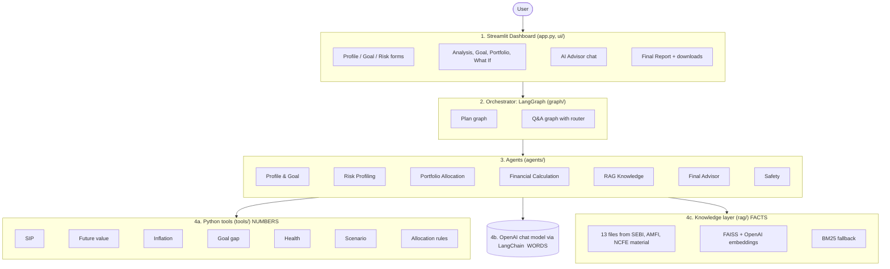
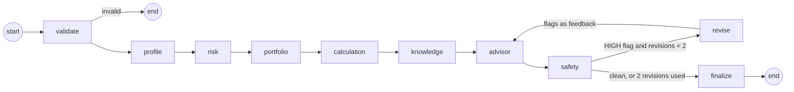
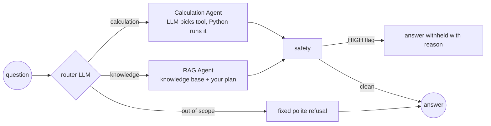
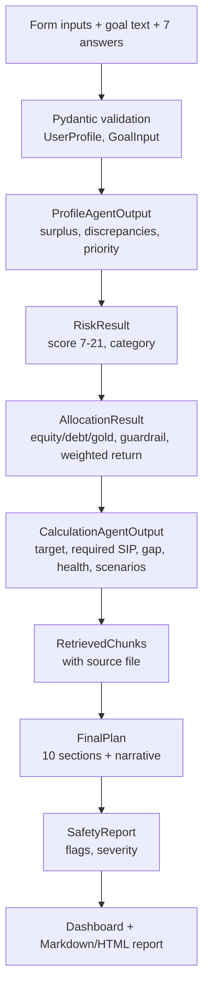
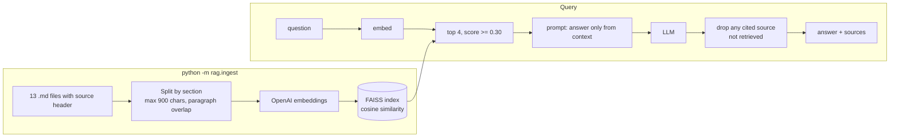

# System Architecture

Rendered images of these diagrams are in `docs/diagrams/`. The Mermaid source below renders on GitHub or at https://mermaid.live.

## 1. Layered architecture

**Core rule:** numbers come from Python tools, words come from the LLM, facts come from the knowledge base or the user. The Safety Agent enforces this.

## 2. Plan graph (LangGraph)

* Every node is wrapped by a guard: an unexpected exception is recorded and the graph stops cleanly.
* Validation and calculation failures are fatal (no plan without numbers). LLM and retrieval failures are not: agents fall back and the plan completes.
* If the narrative still fails safety after 2 revisions, `finalize` withholds it and keeps the numbers.

## 3. Q&A graph (LangGraph)

## 4. Data flow

## 5. Tool flow

| Tool | Called by | Input | Output |
|---|---|---|---|
| `financial_health` | Profile, Calculation | income, expenses, EMI, SIP, emergency fund | surplus, savings rate, debt to income, emergency months |
| `compute_allocation` | Portfolio | risk category, horizon, goal type | equity/debt/gold %, guardrail, weighted return |
| `inflation_adjusted_value` | Calculation (via `plan_goal`) | amount, inflation %, years | future cost |
| `lumpsum_future_value`, `sip_future_value` | Calculation | amount or SIP, return %, months | future value |
| `required_monthly_sip` | Calculation | target, return %, months | monthly SIP |
| `goal_gap` | Calculation | required SIP, current SIP, free surplus | gap, status, affordability |
| `standard_scenarios`, `run_scenario` | Calculation, What If page | base inputs + overrides | scenario rows |
| 6 LangChain wrappers (`tools/lc_tools.py`) | Q&A Calculation Agent | chosen by the LLM | tool result JSON |

## 6. RAG flow

When there is no index or no API key, the retriever falls back to BM25 keyword search over the same chunks and says so in the UI.
